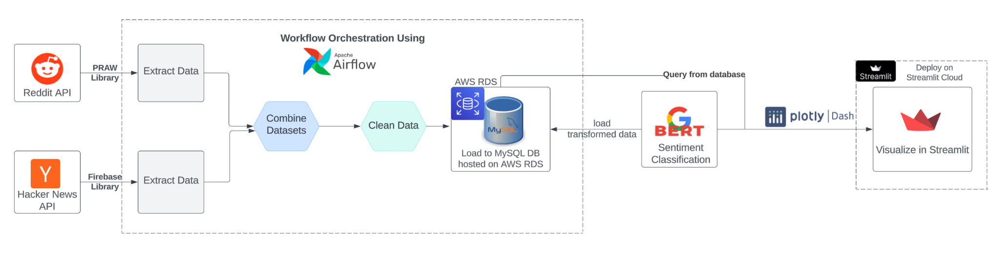

# Large Language Models Leaderboard using Real-time Mining and Sentiment Analysis

## Overview
This project aims to bridge the gap between technological advancements and public sentiment by developing a real-time data mining and sentiment analysis system for Large Language Models (LLMs). We explore diverse perspectives on LLMs from various sources, enhancing understanding of public sentiment towards this transformative technology.

## Team Members
- Khanh Khuat
- Aditi Mondal
- Kiara Cleveland

## Motivation
Recognizing the profound impact of LLMs on society, this project addresses the notable gap in understanding and analyzing public sentiment towards various LLMs such as ChatGPT, LLama2, Gemini, and more.

## System Architecture
- **Data Extraction**: Utilizing Python to extract data from Reddit and HackerNews, focusing on LLM-related discussions.
- **Data Preprocessing & Storage**: Cleaned data is stored in AWS RDS using MySQL, with regular updates via Airflow workflows.
- **Sentiment Analysis**: Utilizes a pre-trained roBERTa model to assign sentiment scores to the extracted data.
- **Model Evaluation**: Assessing the performance with metrics like Accuracy, Precision, Recall, and F1-Score.  

## Interface
Our Streamlit application allows users to interact with the analyzed data through various visualizations and filters:
- **Dashboard URL**: [LLM Check Streamlit App](https://llmcheck.streamlit.app/)

## Key Features
- **Sentiment Distribution Visualization**: Shows sentiment distribution for each LLM and overall trends.
- **Data Insights**: Provides quantitative insights into the engagement and discussions for each LLM.
- **Trend Analysis**: Displays sentiment changes over time and important keywords through word clouds.

## Results
- **Data Coverage**: Analyzed sentiment from over 14 distinct LLMs with a neutral sentiment being the most prevalent.
- **Engagement and Discussion**: Insights into the most talked-about LLMs and sentiment trends.

## Limitations
The current data extraction method is limited to 1000 rows per API call, potentially skewing the data towards a younger, tech-savvy audience primarily from Reddit and HackerNews.

## Future Work
Further enhancements could include expanding the data sources and improving the model's accuracy and response to diverse sentiments.
